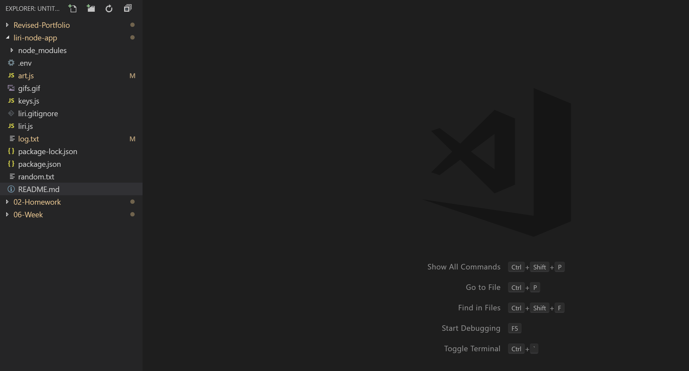

# liri-node-app

# Description

liri-node-app is a node.js application that takes user input and outputs info related to it. Here is a short demo

# Requirments

Being a node.js application, you must have node installed on your machine in order to run this promgram. 
You will also need to apply for a spotify api key and 